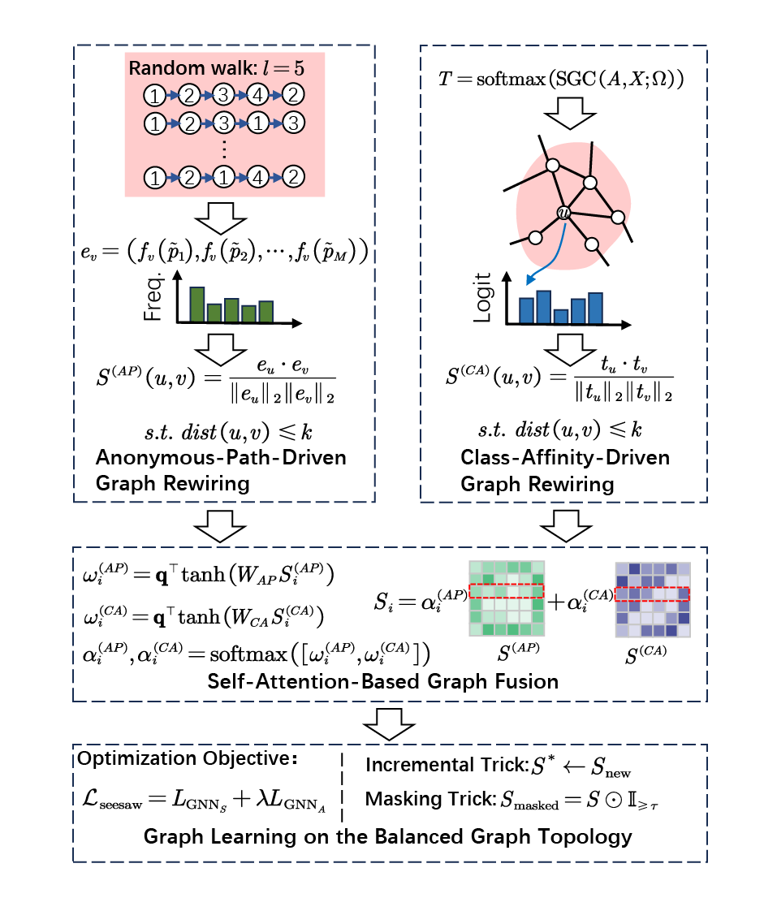

Model-Master Full Reproducible Project
-------------------------------------

Run example:
    python main.py --dataset blogcatalog --epochs 100 --lr 5e-3 --imbalance_ratio 0.9

Notes:
The framework is shown below.

